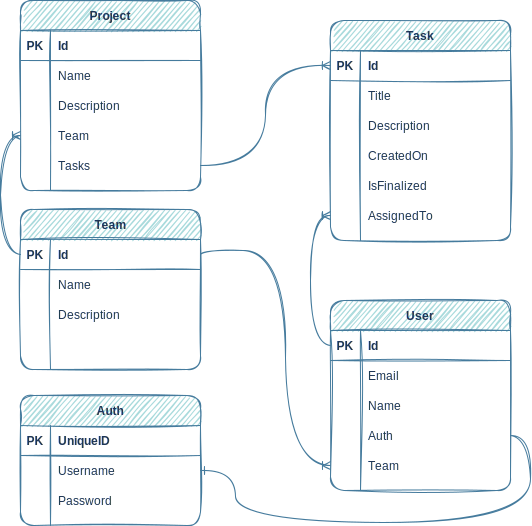

# TasksJs

A proyect for learning purpouses, focused on MERN Stack with Typescript and GraphQL

You can start both frontend and backend running `yarn dev` in the root folder.

## Architecture

## Database Model Diagram

